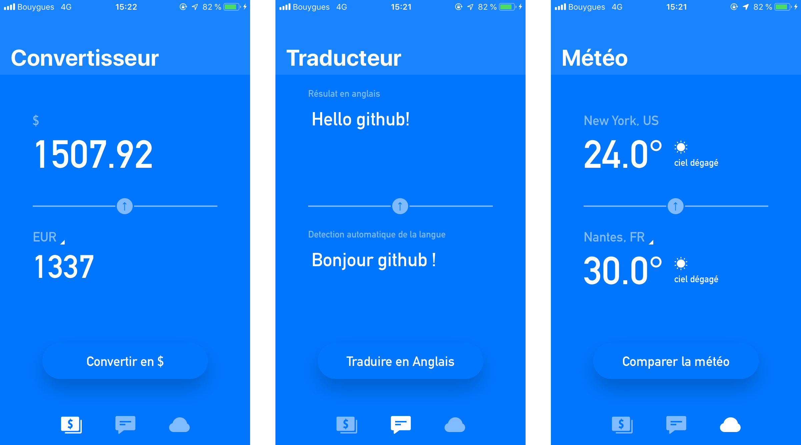

# Application de montage photo

## Compétences à aquérir :

- [ x ] Maîtriser le design pattern MVC
- [ x ] Créer un design responsive à partir d'une maquette
- [ x ] Interpréter les gestes sur un écran tactile

## Screenshots de l'app

