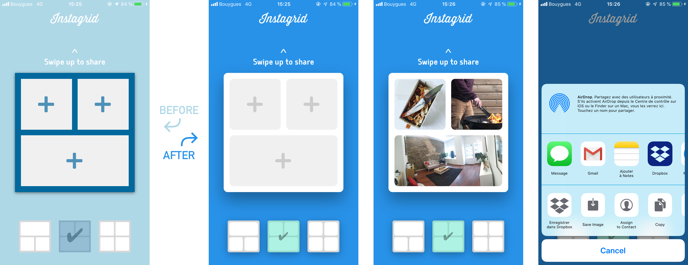

# Application de montage photo

## Compétences à aquérir

- Maîtriser le design pattern MVC
- Créer un design responsive à partir d'une maquette
- Interpréter les gestes sur un écran tactile

## Bonus perso

- Animation du changement de layout
- Création d'un thème custom
- Geste caché (shake) pour activer le thème custom

## Screenshots de l'app

